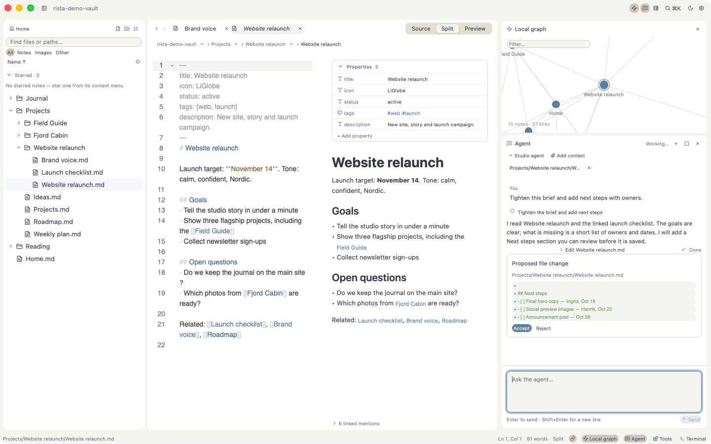
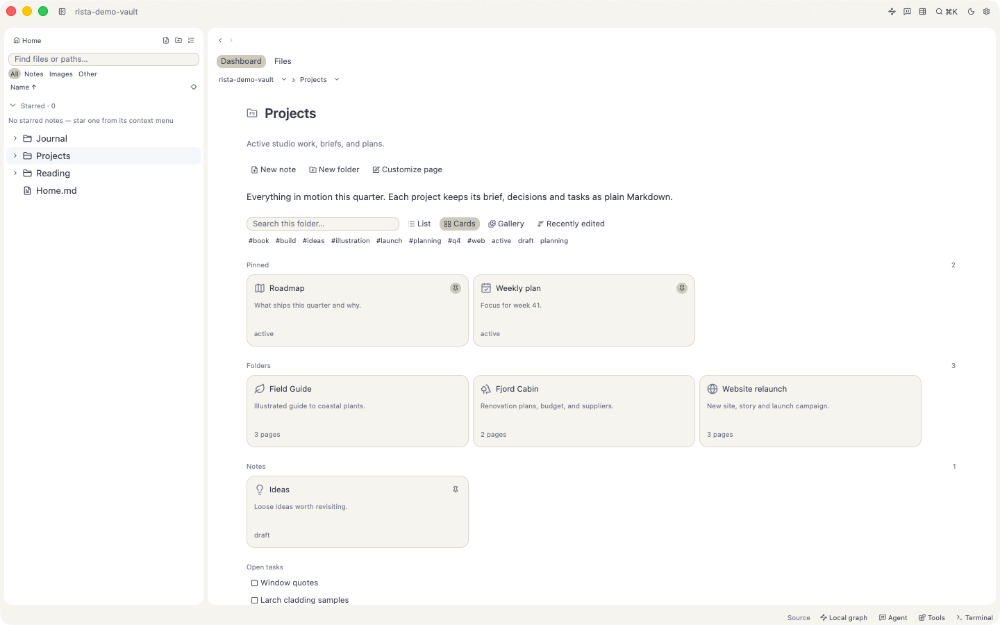

<p align="center">
  
</p>

<h1 align="center">Rísta</h1>
<p align="center"><strong>A quiet place for your notes.</strong></p>
<p align="center">A native Markdown workspace for writing, organising, and thinking with your own files.</p>
<p align="center">
  <a href="https://github.com/henrikogaard/rista/releases/latest">Download for macOS</a> ·
  <a href="docs/README.md">Documentation</a> ·
  <a href="DESIGN.md">Design system</a> ·
  <a href="LICENSE">MIT license</a>
</p>

---

<picture>
  <source media="(prefers-color-scheme: dark)" srcset="docs/screenshots/agent-review-dark.png" />
  
</picture>

<p align="center"><sub>Write in Markdown, see how notes connect, and review every change an agent proposes before it lands.</sub></p>

Rísta turns a folder of Markdown files into a calm, fast workspace. Folders become
pages, notes link into a graph, frontmatter becomes databases, and an agent can
help with your writing — without your notes ever leaving ordinary files on disk.

It is a native app written in Rust, not a web page in a window, and it follows
the look and feel of the Mac.

## Why Rísta

- **Your files, always.** Notes are plain `.md` files, properties are YAML
  frontmatter, images sit next to your notes. No database, no lock-in, no account.
- **Native and quiet.** Compact controls, paired light and dark palettes, and no
  visual noise between you and the page.
- **Organised by folders, not by rules.** Every folder is a living page that shows
  what is inside it — subfolders, pinned notes, tasks, and databases.
- **Help that asks first.** The Agent panel shows what it reads, asks before it
  acts, and proposes edits you accept or reject.
- **Private by default.** No cloud sync, no telemetry, no sign-in.

## Features

### Write in Markdown, beautifully

- Source, live preview, or both side by side (`⌘1` / `⌘2` / `⌘3`), with the
  preview following your place as you write.
- Cover images, image embeds, callouts, tables, task lists, and note icons such
  as `:LiInbox:` — all from standard Markdown.
- An outline for every note, link and image completion with `[[` and `![[`,
  and gentle warnings for links that point nowhere.
- Tabs that behave like a code editor's: single-click to preview, double-click or
  start typing to keep it open.
- Autosave, session restore, local page history, and a zen mode for focused writing.

### Folders that feel like pages

<picture>
  <source media="(prefers-color-scheme: dark)" srcset="docs/screenshots/folder-dashboard-dark.png" />
  
</picture>

<p align="center"><sub>Every folder is a page: pinned notes, subfolders, filters, and open tasks, all read from plain files.</sub></p>

- Click a folder to open its dashboard: an introduction written in Markdown,
  pinned notes, subfolder cards, notes, databases, and open tasks.
- Switch between **List**, **Cards**, and **Gallery**, search inside the folder,
  filter by tag or status, and sort by name or recent edits.
- Prefer a plain view? **Files** shows a compact Name / Type / Modified / Size table.
- Turn on **Show non-Markdown files** to browse images, PDFs, and other files
  alongside your notes, with previews and *Open in default app*.
- Layout and pins are stored in the folder's own Markdown frontmatter, so they
  travel with your vault.

### Notes that connect

- Wikilinks, aliases, note embeds, backlinks, outgoing links, and tags.
- A local graph docked beside your note that follows you from page to page,
  plus a full vault graph (`⌘G`) with search, zoom, and drag.
- A right-hand inspector for properties, outline, links, tasks, and calendar.

### Databases from your own files

- A `.base` file turns notes and their frontmatter into a table, cards, a board,
  or a calendar.
- Filters, formulas, relations, and rollups — with every value still living in
  the notes themselves.

### An agent that works with you

- Open the Agent panel next to your note. The active note is attached as context
  automatically; add more files or folders when you need them.
- Responses stream in as they are written, with clear steps for each action.
- The agent asks permission before it acts, and edits arrive as a clear diff you
  **Accept** or **Reject**. Accepted edits to open notes go through the editor,
  so autosave and conflict checks still apply.
- Works with agents that speak the open Agent Client Protocol. A Vibe preset is
  built in, and you can add your own in a small JSON file.
  See [extensions and agents](docs/extensions.md).

### A real terminal, inside your vault

- A native terminal with independent tabs that look just like your page tabs.
- Right-click any folder → **Open terminal here**.
- Uses your own shell, prompt, and configuration — nothing is rewritten.
- Add your own commands and tool launchers with reloadable JSON extensions,
  then run them on any file or folder from **Tools here…**.

### Make it yours

- Independent light and dark palettes — Rísta, Fjord, and Rose — each with its
  own accent colour.
- **Create theme…** exports the active palette as JSON; edit it, reload, done.
  See [custom palettes](DESIGN.md#custom-palettes).
- Adjustable fonts and sizes for the editor, interface, and terminal.
- Navigation available in English and Norwegian.

## Get Rísta

[Download the latest release](https://github.com/henrikogaard/rista/releases/latest)
for **macOS 13+ on Apple Silicon**. Releases are signed with Developer ID,
notarized by Apple, and include signed automatic updates.

macOS is the primary, tested platform. Linux and Windows are planned but not yet
verified. See the [roadmap and limitations](docs/PRODUCT-ROADMAP.md).

**Updating from v0.1.0–v0.1.2:** quit Rísta and rename the app to `Rista.app` in
Finder before updating, or install the latest DMG and remove the old copy.
Later versions do not need this step.

## Your first page

Choose **Open File** (`⌘O`) for a standalone document, or
**Open Folder** (`⌘⇧O`) for a vault: a normal folder of notes and attachments.

Folder names open live dashboards; the disclosure chevrons expand or collapse
the sidebar independently. Each dashboard lists its immediate folders, notes,
and databases. Enable **Show non-Markdown files** in Settings to include images
and other files, with file-type sorting, read-only text/image previews, and
default-app opening. macOS also offers Quick Look for supported formats such
as PDF. See [other-file previews](docs/folder-pages.md#other-files).
Use Home, breadcrumbs, or Back/Forward to navigate.
An optional `<folder>/<folder>.md` introduction (or `README.md` fallback) supports
Markdown and local images, including frontmatter covers. **Edit introduction**
opens the ordinary Markdown file; no separate dashboard format is created.

The titlebar inspector button shows or hides properties, outline, links, tasks,
calendar, and tags on the right. Settings preserve the inspector and active folder.
New navigation labels support English and Norwegian through **Navigation language**
in Settings; translation of older app-wide controls is not yet complete.

Single-click a file in the tree to browse in a reusable italic preview tab.
Double-click the file or tab to keep it; editing keeps it automatically.
Cmd-click opens a separate tab. Unsaved, conflicted, and pinned notes are never
replaced by browsing.

### Personalise notes and colours

- Use `:LiInbox:` or `:lucide-inbox:` in headings and prose for bundled note
  icons. Unknown icons stay readable as text; Markdown source stays unchanged.
- Settings → **Properties** controls whether frontmatter starts expanded,
  collapsed, or hidden. The inspector still provides editing when hidden.
- Choose independent light and dark palettes: Rísta, Fjord, or Rose. Each palette
  changes surfaces and accent colours together.
- **Create theme…** copies the active palette to an editable JSON file.
  Edit the colours, choose **Reload themes**, then select your palette.
  See [custom palette documentation](DESIGN.md#custom-palettes).
Finder’s **Open With → Rísta** also opens `.md` and `.markdown` files.

Use **Split** (`⌘2`) to see how a note renders. With `cover.jpg` next to
your note, try:

```markdown
---
title: Field notes
cover: cover.jpg
banner_y: 50
status: Draft
---

# A little room to think

Ideas become clearer when you write them down.

> [!note] Keep it simple
> Start with one page, then connect it to [[Tomorrow]].


```

For a small database, create `Notes.base` inside your vault:

```yaml
filters:
  and:
    - 'file.ext == "md"'
views:
  - type: table
    name: Notes
    order:
      - file.name
      - status
```

Open it from the file tree. Rows come from your notes; properties remain in
their frontmatter. `.base` implements a supported expression/view subset,
not a promise of complete compatibility with other tools.

## Keyboard essentials

| Action | macOS |
|---|---|
| New note / Open file / Open folder | `⌘N` / `⌘O` / `⌘⇧O` |
| Save / Save as | `⌘S` / `⌘⇧S` |
| Source / Split / Preview | `⌘1` / `⌘2` / `⌘3` |
| Find / Search vault | `⌘F` / `⌘⇧F` |
| Command palette | `⌘K` |
| Quick open file/folder | `⌘P` |
| Toggle sidebar / Zen mode | `⌘B` / `⌘⇧Enter` |
| Daily note / Graph | `⌘⇧D` / `⌘G` |
| Settings | `⌘,` |

## Build from source

On macOS, install a stable [Rust toolchain](https://rustup.rs) and Xcode
Command Line Tools (`xcode-select --install`), then:

```bash
git clone https://github.com/henrikogaard/rista.git
cd rista
cargo run
# Or open a file/folder at launch:
cargo run -- /absolute/path/to/notes
```

`cargo build --release` produces a binary, not an installable app bundle.
See the [release checklist](docs/RELEASE-CHECKLIST.md) for macOS packaging
and Sparkle signing. A normal `cargo run` does not need Sparkle.

Before submitting a change:

```bash
cargo fmt --check
cargo clippy
cargo test
```

Read [AGENTS.md](AGENTS.md) for code conventions and
[the architecture guide](docs/ARCHITECTURE.md) for the module map.
Use the [manual QA checklist](docs/TEST-CASES.md) for user-facing changes.

## Storage and safety

Notes, attachments, and `.base` definitions live in your own folder.
Vault history and trash live under `.rista/`. Settings and session state
live in `~/Library/Application Support/no.ogard.rista/settings.json` on macOS.

Rísta checks for external changes before saving and stops on conflicts rather
than silently overwriting them. History is not a backup: keep independent
backups, especially while using an early release.

## License

[MIT](LICENSE) · Copyright (c) 2026 Henrik Øgård.
Dependencies retain their respective licenses.
