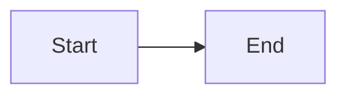

# D2 & Mermaid Diagram Support — Implementation Plan

> **For agentic workers:** REQUIRED SUB-SKILL: Use superpowers:subagent-driven-development (recommended) or superpowers:executing-plans to implement this plan task-by-task. Steps use checkbox (`- [ ]`) syntax for tracking.

**Goal:** Render D2 and Mermaid fenced code blocks as SVG diagrams in the preview pane.

**Architecture:** Post-HTML DOM rewriting. After `renderMarkdown()` sets innerHTML on preview elements, a new `processDiagrams()` function scans for `language-d2` and `language-mermaid` code blocks and replaces them with rendered SVGs. Mermaid renders in-browser via its JS library. D2 shells out to the local `d2` CLI via a new IPC handler.

**Tech Stack:** mermaid (npm), d2 CLI (system), Electron IPC (child_process)

---

### Task 1: Install mermaid dependency

**Files:**
- Modify: `package.json:37-51`

- [ ] **Step 1: Install mermaid**

```bash
npm install mermaid
```

- [ ] **Step 2: Verify it installed**

```bash
node -e "require('mermaid'); console.log('ok')"
```

Expected: `ok`

- [ ] **Step 3: Commit**

```bash
git add package.json package-lock.json
git commit -m "feat: add mermaid dependency for diagram rendering"
```

---

### Task 2: Add D2 IPC handler in main process

**Files:**
- Modify: `src/main/main.js:1-4` (add `execFile` import)
- Modify: `src/main/main.js` (add handler after line 377)
- Modify: `src/main/preload.js:20-21` (add `renderD2` to bridge)

- [ ] **Step 1: Add child_process import to main.js**

At the top of `src/main/main.js`, add `execFile` to the requires. Change line 1-4 area:

```js
const { app, BrowserWindow, ipcMain, dialog, Menu, shell, nativeImage } = require('electron')
const path = require('path')
const fs = require('fs')
const { execFile } = require('child_process')
const chokidar = require('chokidar')
```

- [ ] **Step 2: Add render:d2 IPC handler to main.js**

Append after the PDF export handler (after line 377):

```js
// ── IPC: Render D2 diagram ────────────────────────────────────────
ipcMain.handle('render:d2', async (_, source, themeId = 0) => {
  return new Promise((resolve) => {
    const args = ['-', '-', '--theme', String(themeId)]
    try {
      const child = execFile('d2', args, {
        timeout: 5000,
        maxBuffer: 1024 * 1024 * 4,
        env: { ...process.env },
      }, (error, stdout, stderr) => {
        if (error) {
          if (error.code === 'ENOENT') {
            return resolve({ error: 'D2 is not installed. Install from https://d2lang.com' })
          }
          if (error.killed) {
            return resolve({ error: 'D2 rendering timed out' })
          }
          return resolve({ error: stderr || error.message })
        }
        resolve({ svg: stdout })
      })
      child.stdin.write(source)
      child.stdin.end()
    } catch (err) {
      resolve({ error: err.message })
    }
  })
})
```

- [ ] **Step 3: Expose renderD2 in preload.js**

Add between the `exportPdf` line and the `onFileChange` line in `src/main/preload.js`:

```js
  // Diagram rendering
  renderD2: (source, themeId) => ipcRenderer.invoke('render:d2', source, themeId),
```

- [ ] **Step 4: Commit**

```bash
git add src/main/main.js src/main/preload.js
git commit -m "feat: add D2 CLI IPC handler for diagram rendering"
```

---

### Task 3: Create diagrams.js module

**Files:**
- Create: `src/renderer/diagrams.js`

- [ ] **Step 1: Create src/renderer/diagrams.js**

```js
import mermaid from 'mermaid'

// ── Cache ─────────────────────────────────────────────────────────
const cache = new Map()
let mermaidIdCounter = 0

function cacheKey(lang, source, theme) {
  return `${lang}:${theme}:${source}`
}

// ── Mermaid init ──────────────────────────────────────────────────
function getMermaidThemeConfig(theme) {
  const isDark = theme === 'dark'
  return {
    startOnLoad: false,
    theme: isDark ? 'dark' : 'default',
    themeVariables: isDark
      ? {
          primaryColor: '#1c1d20',
          primaryTextColor: '#dddfe6',
          primaryBorderColor: '#2e3033',
          lineColor: '#484b57',
          secondaryColor: '#161719',
          tertiaryColor: '#111214',
          noteBkgColor: '#1c1d20',
          noteTextColor: '#7a7d8a',
          fontFamily: "'DM Sans', system-ui, sans-serif",
        }
      : {
          primaryColor: '#d8d1c7',
          primaryTextColor: '#221d18',
          primaryBorderColor: '#b8aea0',
          lineColor: '#5f564b',
          secondaryColor: '#e2ddd4',
          tertiaryColor: '#e9e6df',
          noteBkgColor: '#e2ddd4',
          noteTextColor: '#5f564b',
          fontFamily: "'DM Sans', system-ui, sans-serif",
        },
  }
}

let currentTheme = 'dark'

export function initDiagrams(theme = 'dark') {
  currentTheme = theme
  mermaid.initialize(getMermaidThemeConfig(theme))
}

export function clearDiagramCache() {
  cache.clear()
}

// ── D2 theme mapping ──────────────────────────────────────────────
function getD2ThemeId(theme) {
  return theme === 'dark' ? 200 : 0
}

// ── Render a single Mermaid block ─────────────────────────────────
async function renderMermaidBlock(source) {
  const id = `fjord-mermaid-${mermaidIdCounter++}`
  try {
    const { svg } = await mermaid.render(id, source)
    return { svg }
  } catch (err) {
    // mermaid may insert a broken element into the DOM; clean up
    document.getElementById(id)?.remove()
    const msg = err?.message || err?.str || String(err)
    return { error: msg }
  }
}

// ── Render a single D2 block ──────────────────────────────────────
async function renderD2Block(source, theme) {
  if (!window.fjord?.renderD2) {
    return { error: 'D2 rendering is not available' }
  }
  const themeId = getD2ThemeId(theme)
  return window.fjord.renderD2(source, themeId)
}

// ── Build result DOM ──────────────────────────────────────────────
function buildDiagramElement(lang, result) {
  const wrapper = document.createElement('div')
  wrapper.className = `diagram diagram--${lang}`

  if (result.error) {
    wrapper.className = 'diagram diagram--error'
    wrapper.textContent = result.error
    return wrapper
  }

  wrapper.innerHTML = result.svg
  return wrapper
}

// ── Main: process all diagram blocks in a preview element ─────────
export async function processDiagrams(previewElement, theme) {
  if (!previewElement) return

  currentTheme = theme || currentTheme
  const blocks = previewElement.querySelectorAll(
    'pre > code[class*="language-d2"], pre > code[class*="language-mermaid"]'
  )

  const promises = Array.from(blocks).map(async (codeEl) => {
    const preEl = codeEl.parentElement
    if (!preEl || preEl.tagName !== 'PRE') return

    const classes = codeEl.className
    const lang = classes.includes('language-d2') ? 'd2'
      : classes.includes('language-mermaid') ? 'mermaid'
      : null
    if (!lang) return

    const source = codeEl.textContent.trim()
    if (!source) return

    const key = cacheKey(lang, source, currentTheme)
    let result = cache.get(key)

    if (!result) {
      result = lang === 'mermaid'
        ? await renderMermaidBlock(source)
        : await renderD2Block(source, currentTheme)
      cache.set(key, result)
    }

    const diagramEl = buildDiagramElement(lang, result)
    preEl.replaceWith(diagramEl)
  })

  await Promise.all(promises)
}
```

- [ ] **Step 2: Commit**

```bash
git add src/renderer/diagrams.js
git commit -m "feat: add diagrams.js module for Mermaid and D2 rendering"
```

---

### Task 4: Integrate diagrams into index.js

**Files:**
- Modify: `src/renderer/index.js:1-6` (add import)
- Modify: `src/renderer/index.js:9-11` (add initDiagrams call)
- Modify: `src/renderer/index.js:1654-1661` (add processDiagrams to refreshPreview)
- Modify: `src/renderer/index.js:377-394` (add clearDiagramCache to theme toggle)

- [ ] **Step 1: Add import for diagrams.js**

At the top of `src/renderer/index.js`, add after line 5:

```js
import { initDiagrams, processDiagrams, clearDiagramCache } from './diagrams.js'
```

- [ ] **Step 2: Call initDiagrams at startup**

After line 11 (`applySettings()`), add:

```js
initDiagrams(getTheme())
```

- [ ] **Step 3: Hook processDiagrams into refreshPreview**

Replace the `refreshPreview` function (lines 1655-1661):

```js
async function refreshPreview(pane, markdown) {
  const html = await renderMarkdown(markdown)
  const theme = getTheme()
  ;['single', 'left', 'right'].forEach(slot => {
    const p = $(`preview-${slot}-${pane}`)
    if (p) p.innerHTML = html
  })
  // Render diagrams in all visible preview slots
  const diagramPromises = ['single', 'left', 'right'].map(slot => {
    const p = $(`preview-${slot}-${pane}`)
    return p ? processDiagrams(p, theme) : null
  }).filter(Boolean)
  await Promise.all(diagramPromises)
}
```

- [ ] **Step 4: Clear diagram cache on theme toggle**

In the theme toggle handler (inside `buildShell()`, around line 377-394), add `clearDiagramCache()` and `initDiagrams(t)` calls. After `const t = toggleTheme()` and before the pane loop:

```js
  $('theme-btn').addEventListener('click', () => {
    const t = toggleTheme()
    applySettings(getSettings())
    clearDiagramCache()
    initDiagrams(t)
    $('theme-btn').innerHTML = t === 'dark' ? sunIcon() : moonIcon()
    PANE_KEYS.forEach(pane => {
```

- [ ] **Step 5: Commit**

```bash
git add src/renderer/index.js
git commit -m "feat: integrate diagram rendering into preview pipeline"
```

---

### Task 5: Add CSS styles for diagrams

**Files:**
- Modify: `src/renderer/styles/main.css` (add after line 1728, after callout styles)

- [ ] **Step 1: Add diagram styles**

Insert after the callout styles block (after `.preview-pane .callout--danger`):

```css
/* ── Diagram blocks ── */
.diagram {
  display: block;
  margin: 12px 0;
  text-align: center;
  overflow-x: auto;
}
.diagram svg {
  max-width: 100%;
  height: auto;
}
.diagram--error {
  background: var(--bg2);
  border-left: 3px solid var(--amber);
  padding: 12px 16px;
  margin: 12px 0;
  font-family: var(--mono);
  font-size: 12px;
  color: var(--text2);
  text-align: left;
  white-space: pre-wrap;
  word-break: break-word;
}
```

- [ ] **Step 2: Commit**

```bash
git add src/renderer/styles/main.css
git commit -m "style: add diagram rendering and error styles"
```

---

### Task 6: Build and manual test

- [ ] **Step 1: Run the build**

```bash
npm run build
```

Expected: esbuild completes without errors.

- [ ] **Step 2: Verify the app starts**

```bash
npm start
```

Open a markdown file with a mermaid block:

````

````

Verify the preview renders an SVG diagram.

- [ ] **Step 3: Commit all if any remaining changes**

```bash
git add -A
git commit -m "feat: complete D2 and Mermaid diagram support"
```
